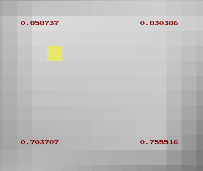
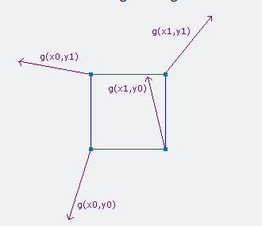
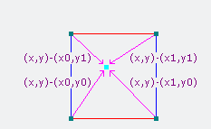
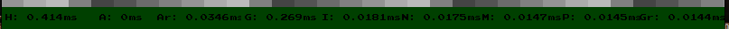
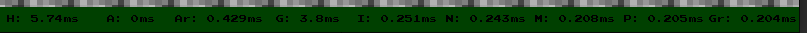
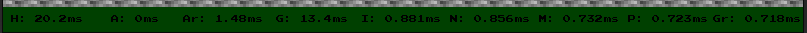
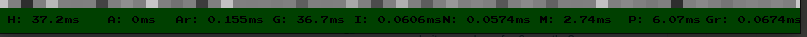

# terrain

A terrain generator.

# Installation

## Prerequisite

This projects uses:

- [google test](https://github.com/google/googletest): installation instructions [here](https://www.eriksmistad.no/getting-started-with-google-test-on-ubuntu/), a simple `sudo apt-get install libgtest-dev` should be enough.
- [cmake](https://cmake.org/): installation instructions [here](https://askubuntu.com/questions/355565/how-do-i-install-the-latest-version-of-cmake-from-the-command-line), a simple `apt-get` should also be enough.
- [eigen](https://eigen.tuxfamily.org/index.php?title=Main_Page): installation instructions [here](https://www.cyberithub.com/how-to-install-eigen3-on-ubuntu-20-04-lts-focal-fossa/) for Ubuntu 20.04, a simple `sudo apt install libeigen3-dev` should be enough.

## Instructions

- Clone the repo: `git clone git@github.com:Knoblauchpilze/terrain.git`.
- Clone dependencies:
  - [core_utils](https://github.com/Knoblauchpilze/core_utils)
  - [maths_utils](https://github.com/Knoblauchpilze/maths_utils)
- Go to the project's directory `cd ~/path/to/the/repo`.
- Compile: `make run`.

Don't forget to add `/usr/local/lib` to your `LD_LIBRARY_PATH` to be able to load shared libraries at runtime. This is handled automatically when using the `make run` target (which internally uses the [run.sh](data/run.sh) script).

# Principle

## Resources
We used various online resources to understand how to properly implement Perlin noise and generate a terrain. Some of the sources are scattered in the code, but a curated list is presented here:
* the initial idea to start the project came from [this](https://medium.com/@henchman/adventures-in-procedural-terrain-generation-part-1-b64c29e2367a) medium article.
* this [series](https://www.scratchapixel.com/lessons/procedural-generation-virtual-worlds/procedural-patterns-noise-part-1/introduction.html) over at scratchpixel provides some code example which were very useful to understand what is going on.
* This [question](https://gamedev.stackexchange.com/questions/166124/perlin-noise-generation-always-returning-zero) on gamedev resource was helpful to understand that it's expected that the values at the lattice points is always 0.
* This [video](https://www.youtube.com/watch?v=ZZY9YE7rZJw) from javidx9 helped understand how to procedurally generate something.
* This gamedev [topic](https://gamedev.stackexchange.com/questions/183142/how-can-i-create-a-persistent-seed-for-each-chunk-of-an-infinite-procedural-worl) allowed to hash a pair of coordinates into a single value.

## How it works

Generated a procedural terrain is a combination of several things:
* we need a way to consistently generate the same random values based on input coordinates.
* we need to generate coherent noise across a chunk of space.

These two constraints have given birth to various algorithms to generate terrain. In this project we chose to give the Perlin noise a go. The Perlin noise in and of itself is a periodic coherent noise which aims at generating a lattice of random gradient vectors at integer coordinates and then use this to interpolate the values in between.

Using a periodic lattice allows to easily guarantee the consistency of the data (as we then project each point on a grid, so the consistency is guaranteed by the projection algorithm) and the lattice approach guarantees some coherence between values.

The variety of the terrain is then of course proportional to the size of the lattice we generate. We can remove this limitation by using a procedural approach (similar to what is described by javidx9).

Generating the terrain is then a question of combining several frequencies of noise, and adding multiple noises to account for humidity, height, erosion, etc. and then extracting the terrain type from this.

## Implementation

We decided to separate the concerns of generating the values for the lattice from the generation of the lattice and from the generation of the final noise value at a point. Additionally creating the terrain from several layers of noise is also a dedicated operation.

In general:
* [INoise](src/lib/game/terrain/noise/INoise.hh) represents the interface to generate some noise. It is used as a wrapper around some abstract way to produce 1D noise.
* [IHasher](src/lib/game/terrain/hasher/IHasher.hh) is used to generate a single value from multiple coordinates. This is useful to seed the noise generator.
* [IValueGenerator](src/lib/game/terrain/generator/IValueGenerator.hh) is used to generate the value at a specific lattice point based on a noise and use the `IHasher` interface to consistently produce the same values for the same coordinates.
* [ILattice](src/lib/game/terrain/lattice/ILattice.hh) allows to generate the noise value at a specific point based on the values at the lattice point surrounding it. It reuses a certain value generator and combines these value using some interpolation mechanism and a normalization function to produce noise within a certain range.

The [Terrain](src/lib/game/terrain/Terrain.hh) class is using a lattice to combine it into a consistent value. It uses layered noise and various frequencies to generate coherent values (TODO).

## Generation

We explored multiple ways to generate the noise. The main strategies are listed below:

### Value noise

The value noise is probably the simplest idea. For each lattice point we create a single value attached to it. The value between the lattice points is then interpolated from the surrounding area.

This is relatively simple to understand but it is known to suffer from a few drawbacks. One of them is that if the influence of the value at a lattice point is dependent on the values at the surrounding lattice points.

Picture the following area:

In this example all four lattice points have very similar values, meaning that the whole area will be relatively flat. This is usually not a desired feature as  it will make the terrain look flat and boring (even if this can be compensated by adding octaves of noise).

### Gradient noise

The idea behind the gradient noise is to generate a vector of values at each lattice point:

For a point within this lattice area, we then compute the vectors from the point to the lattice point. The influence of each lattice point's gradient vector is determined by the dot product between the gradient vector and the previously computed vector.

This makes it harder to have a flat surface as when the point moves within the lattice area it will change its dot product with the surrounding gradients. Our understanding is that it's also harder to obtain the same value for the gradient vectors as they are multi-dimensional.

The images were taken from [here](https://adrianb.io/2014/08/09/perlinnoise.html).

### Perlin noise

The infamous Perlin noise is then a special case of gradient noise. In our implementation we changed the gradient vector to not be random but correspond to the values described in [this](https://mrl.cs.nyu.edu/~perlin/paper445.pdf) article: they point to the corners of a unit cube and are supposed to help with the distribution of the vectors.

## Further ideas

This [article](https://www.codeproject.com/Articles/785084/A-generic-lattice-noise-algorithm-an-evolution-of) about generalizing the use of a lattice to create noise seems pretty interesting.

# Benchmark

The performance values are very different based on whether we use a fully procedural generation or a periodic one. The periodic value allows to skip the expensive `seed` operation of the noise generator for each coordinate but doesn't allow for infinite generation of different landscape.

Note that these consideration might seem important in this app as we're basically just generating some terrain but it might be less the case in an app where the terrain is generated once and for all, or on a chunk basis.

The code for the benchmark can be found in the dedicated [PR #2](https://github.com/Knoblauchpilze/terrain/pull/2).

## Periodic noise

The performance of the periodic noise are similar no matter the period: what's important is the fact that we don't `seed` the noise generator at each rendering.

The benchmark below only accounts for the time taken by the `Terrain` to generate a single layer of noise. This should be updated based on how many layers we use and how many noise are combined to obtain the final terrain value.

Below are some values for various size of noise to generate.

### Small:

Rendering window: ~`[31; 24]` (from `[-14; -5]` to `[17; 16]`)

FPS: ~265fps

Timing:

### Medium:

Rendering window: ~`[127; 83]` (from `[8; -40]` to `[135; 43]`)

FPS: ~108fps

Timing:

### Large

Rendering window: ~`[252; 188]` (from `[-122; -145]` to `[130; 43]`)

FPS: ~30fps

Timing:

## Non periodic noise

The performance here are much poorer and the study is a bit less extensive.

Rendering window:  ~`[63; 44]` (from `[-51; -24]` to `[12; 20]`)

FPS: ~24fps

Timing:

## Analysis

By looking at the performance for large rendering we notice that as expected the part of the generation which takes the most time is the creation of values for lattice point.

In the above plots the values are measured per frame, meaning that for a rendering window, this is the total time spend in function X during each frame in milliseconds.

The letters represent respectively:
* `H` represent the time to call the `height`.
* `Ar` represent the time to generate the area (e.g. lattice points) surrounding a sampling point.
* `G` represent the time to generate the values for the lattice points. This include all lattice points.
* `I` represent the time to interpolate the values at the lattice points to get the final terrain value.
* `N` represent the time to normalize the terrain value.
* `M` represent the time to see the noise generator in the case of the non periodic terrain and the time to compute the index to use to fetch the periodic value.
* `P` represent the time to either find the gradient value among the periodic values or to generate a gradient using the noise (for the non periodic case).
* `Gr` represent the time to actually compute the gradient once the lattice point value has been found.

For `M`, `P` and `Gr`, each value is just the average for a single lattice point, so the time `G` includes 4 times each value.

The periodic case is more or less equal in terms of what takes the most time per lattice point while the non periodic case is clearly very biased in generating the noise values.

It's not clear how to propperly optimize the periodic case as it seems we're already relatively bottleneck-ing a bit everywhere.
